<!--
Put funding source:  National Science Foundation PFI:BIC Award No: 1632227

Put your department:  Department of Statistical Science, and write out "Baylor University"  Most folks won't know what "BU" stands for.
-->

```{r setup, include=FALSE}
knitr::opts_chunk$set(echo = FALSE)
options(knitr.table.format = "html")
```

## Overview of Topics

- Introduction & Motivating Example
- Multi-State AD-PCA
- Simulation Study
- Case Study Results
- Software Package for `R`
- Summary and References

<!---
This is the html tag for a comment.
-->

<div class="notes">
  Smile! :) You got this!
  </div>
  
# Introduction & Motivating Example
  
## Introduction
- Many factories or other closed production systems use real-time online process monitoring.
- We aim to detect potential problems within the system before they cause damage or cause the process to shut down.
- Data description:
    + non-Gaussian process
    + multiple correlated variables
    + temporal dependence of observations
    + non-stationary due to operator input an ambient conditions

## Process Dimensionality
- In multivariate contexts, the number of parameters to estimate increases quadratically with dimension.
- That is, we must estimate $p + \frac{p}{2}(p + 1) \in \mathbb{O}(p^2)$ first- and second-moment parameters if we have $p$ features.
- Linear dimension reduction (LDR) allows us to simplify complex data structures to more simple data structures via linear combinations of features.
- LDR is built around eigen-decomposition / principal component analysis (PCA) or the singular value decomposition (SVD).

## Facility and Process Details
- This work is motivated by our partnership with the Colorado School of Mines on the ReNUWit water preservation grant.
- Our team manages a decentralised wastewater treatment (WWT) plant in Golden, CO.
- We measure 40 features and their lagged values (80 total features).
- The continuous features are aggregated to the minute-level.
- We aim to quickly and accurately detect process malfunctions before human operators by incorporating known system state behavior.
- Stock PCA applied to WWT by @wise_principal_1988 and chemical process monitoring by @kresta_multivariate_1991
- @baggiani_real-time_2009 used adaptive PCA, @sanchez-fernandez_fault_2015 used distributive PCA, and @kazor_comparison_2016 used adaptive-dynamic PCA to monitor WWT processes.

## The Bioreactor System
```{r, fig.align = 'center', out.width='100%'}
knitr::include_graphics("Kate_SBMBR_Design.JPG")
```

## Multi-State Process
```{r, fig.align = 'center', out.width='75%'}
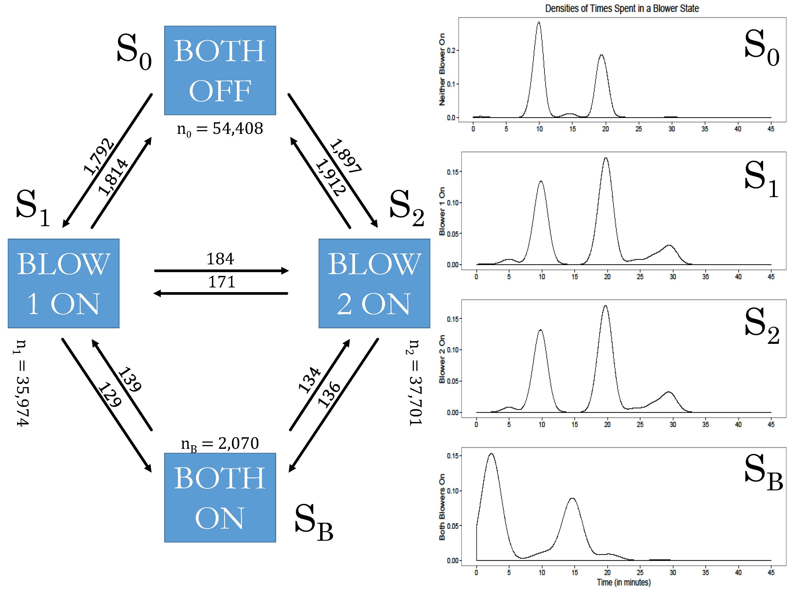
```

<!--
## Example Features
```{r, fig.align = 'center', out.width='75%'}
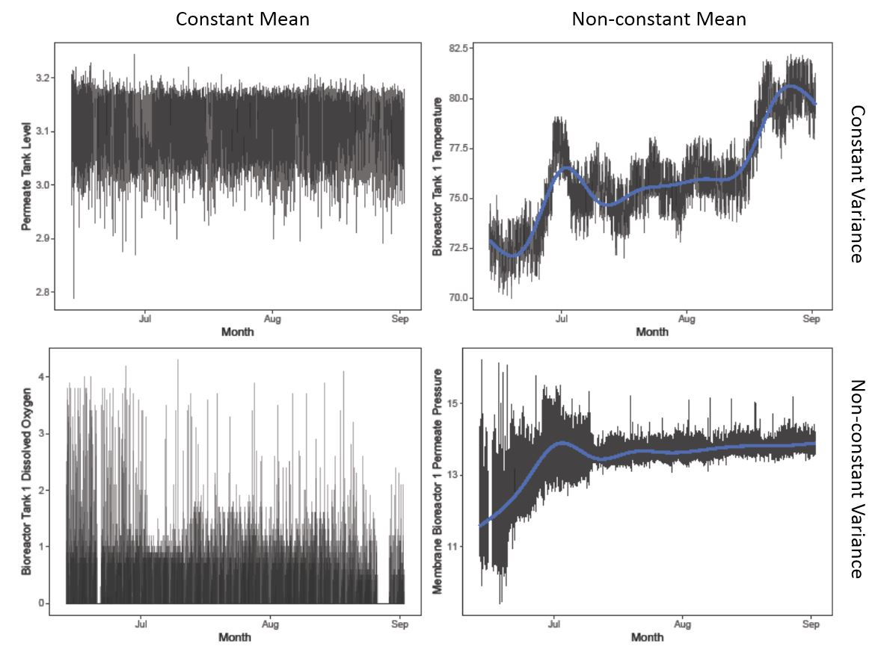
```
-->

## Example Feature by Blower
```{r, fig.align = 'center', out.width='85%', out.height='50%'}
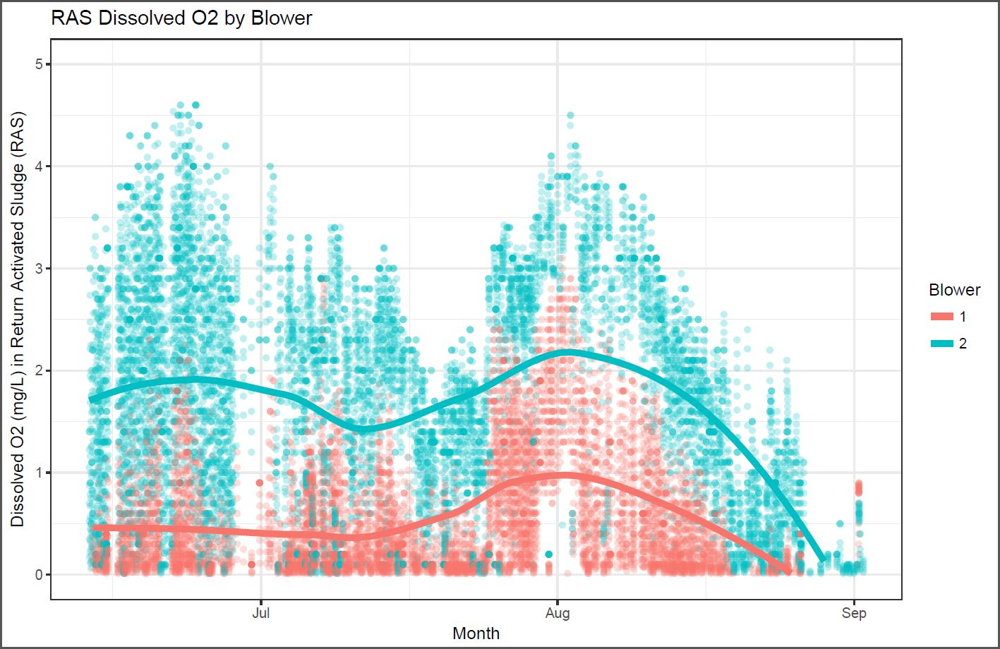
```

<!--
## Data Cleaning
- Features were recorded on different time scales:
    + 5 second,
    + 1 minute,
    + 10 minute.
- Blower Operation was recorded on the 1-minute scale.
- Aggregate the 5-second-level observations to the 1-minute scale.
- Downscale and jitter the 10-minute-level observations to the 1-minute scale.

As of a few months ago, all process features are now recorded on the same 1-minute interval.
-->


# Multi-State AD-PCA

<!--
## Process Notation
- $\mathcal{P}$ is a real $p$-dimensional multivariate process.
- $s = 1, \ldots, n$ is the observation index of $\mathcal{P}$.
- $\textbf{X}_s := \left(X_1(s), X_2(s), \ldots, X_p(s)\right) \in\mathbb{R}_{1 \times p}$ is a whitened realization from $\mathcal{P}$.
- $\textbf{X} := [\textbf{X}_1\ \vdots\ \textbf{X}_2\ \vdots\ \cdots\ \vdots\ \textbf{X}_n]^T \in \mathbb{R}_{n\times p}$ is the data matrix.
- $\textbf{X}^T\textbf{X}\in\mathbb{R}_{p \times p}^{\ge}$ is the scatter matrix of $\textbf{X}$.
- $\mathbb{R}_{p \times p}^{\ge}$ is the $p$-dimensional cone of real, non-negative definite matrices.
-->

## PCA Basics
- $\textbf{X} := [\textbf{X}_1\ \vdots\ \textbf{X}_2\ \vdots\ \cdots\ \vdots\ \textbf{X}_n]^T \in \mathbb{R}_{n\times p}$, where $\textbf{X}_s := \left(X_1(s), X_2(s), \ldots, X_p(s)\right)$ is a realization from process  $\mathcal{P}$ on index $s = 1, \ldots, n$.
- $\textbf{X}^T\textbf{X} := \textbf{P} \times \boldsymbol\Lambda \times \textbf{P}^T$ is the eigendecomposition of the scatter matrix.
- $\textbf{P}^T$ is the $p \times p$ orthogonal matrix of eigenvectors.
- $\boldsymbol\Lambda$ is the diagonal matrix of the $p$ eigenvalues.
- $\textbf{P}_d$ is the $p\times d$ projection matrix preserving the total data variation (energy) corresponding to 
\[
\left[\sum\limits_{i = 1}^d \lambda_i\right] / \text{tr}\left(\boldsymbol\Lambda\right).
\]
- $\textbf{Y}_s := \textbf{X}_s\textbf{P}_d \in\mathbb{R}_{1\times d}$ is the reduced-dimension representation of observation $\textbf{X}_s$.

## Competing Methods
PCA is non-optimal because of the autocorrelation and non-linearity / non-stationarity of the data. Some alternatives are:

- Adaptive-Dynamic PCA (AD-PCA) of @kazor_comparison_2016
- Kernel PCA (kPCA) of @ge_improved_2009
- Adaptive kPCA (AkPCA) of @chouaib_adaptive_2013
- Local Linear Embedding (LLE) @miao_nonlinear_2013
- Multi-dimensional scaling and isometric mapping (IsoMap) of @tenenbaum_global_2000
- Semidefinite Embedding (SDE) / Maximimum Variance Unfolding (MVU) of @weinberger_unsupervised_2006

We combine Adaptive, Dynamic, and Multi-State modifications to PCA.

## Adaptive PCA
- Assume $\mathcal{P}$ is locally linear within a window $w + n_u$.
- Create a $w$-width rolling training window preceding index $s$ by defining
\[
\textbf{X}_{w} := [\textbf{X}_{s - w + 1}\ \vdots\ \textbf{X}_{s - w + 2}\ \vdots\ \cdots\ \vdots\ \textbf{X}_{s - 1}\ \vdots\ \textbf{X}_s]^T.
\]
- Calculate the scatter matrix with $\textbf{X}_{w}$ instead of the full data matrix $\textbf{X}$.
- Estimate $\textbf{P}_d$.
- After performing necessary monitoring statistics on the new observations, ''learn'' the newest $n_u$ observations, ''forget'' the oldest $n_u$ observations, and estimate the new scatter matrix.

## Dynamic PCA
- Because the features are correlated over time, we include up to $\ell$ lags per feature.
- The observation vector at index $s$ is now
$$
\begin{align}
\text{L}(\textbf{X}_s) := &[X_1(s), X_1\left( s - 1 \right), \ldots, X_1\left( s - \ell \right),\ X_2(s), X_2\left( s - 1 \right), \ldots, X_2\left( s - \ell \right), \\
&\qquad \cdots,\ X_p(s),  X_p\left( s - 1 \right), \ldots, X_p\left( s - \ell \right)].
\end{align}
$$
- These $n - \ell$ rows form the lagged data matrix
\[
\text{L}(\textbf{X}) := [\text{L}(\textbf{X}_{\ell})\ \vdots\ \text{L}(\textbf{X}_{\ell + 1})\ \vdots\ \cdots\ \vdots\ \text{L}(\textbf{X}_n)]^T \in\mathbb{R}_{(n - \ell) \times p(\ell + 1)}.
\]
- Calculate the scatter matrix with $\text{L}(\textbf{X})$ instead of the data matrix $\textbf{X}$.
- Estimate the $p(\ell + 1) \times d$ projection matrix $\textbf{P}_d$.

## Multi-State PCA
- Let $\mathcal{S}_k,\ k = 1, \ldots, K$ be a set of disjoint process states.
- For the index $s$, the observation $\textbf{X}_{s}$ is said to belong in state $\mathcal{S}_k$ if and only if
\[
\textbf{X}_{s} \sim f_k\left( \boldsymbol\mu_k, \boldsymbol\Sigma_k \right).
\]
- $f_k$ is some distribution with location parameter $\boldsymbol\mu_k \in \mathbb{R}_{p\times 1}$ and $\boldsymbol\Sigma_k \in \mathbb{R}^{\ge}_{p\times p}$
- Because the distribution changes from state to state, the principal components are also a function of the state.
- Partition $\textbf{X}$ as $\left\{\textbf{X}^{(1)}, \textbf{X}^{(2)}, \ldots, \textbf{X}^{(K)}\right\}$, where $\textbf{X}^{(k)}$ is the ordered set of observations under state $\mathcal{S}_k$.
-  Estimate $K$ distinct projection matrices $\left\{\textbf{P}_d^{(1)}, \textbf{P}_d^{(2)}, \ldots, \textbf{P}_d^{(K)}\right\}$ from the partitioned $\textbf{X}$.

<!---
## MSAD-PCA
- Add the chosen lagged features (Dynamic).
- Partition the data matrix by states (Multi-State).
- Consider observations within a rolling window (Adaptive).
-->

## Monitoring Statistics
These statistics are estimated non-parametrically, as discussed by @kazor_comparison_2016

### Hotelling's $T^2$
- The $T^2$ statistic is the Mahalanobis distance of the mapped value $\textbf{Y}_{s + 1}$ from the original space into the PCA-subspace.
- The $T^2$ statistic is $T^2_{s + 1} = \textbf{Y}_{s + 1}\boldsymbol\Lambda_d^{-1} \textbf{Y}_{s + 1}^T$, for $\boldsymbol\Lambda_d := \text{diag}\left( \lambda_1, \lambda_2, \ldots, \lambda_d \right)$.

### Squared Prediction Error
- The *SPE* statistic measures the goodness-of-fit of the $d$-dimensional model to the $p$-dimensional process observations, or how well $\textbf{P}_d$ approximates $\textbf{P}$.
- The *SPE* statistic is $\text{SPE}(\textbf{Y}_{s + 1}) = \left( \textbf{X}_{s + 1} - \textbf{Y}_{s + 1}\textbf{P}^T_d \right) \left( \textbf{X}_{s + 1} - \textbf{Y}_{s + 1}\textbf{P}^T_d \right)^T.$


# Simulation of NOC Observations

<!--
## Notation
To induce non-linearity and non-stationarity of each feature, let

- the errors of $t$, $\epsilon_t$,  be drawn from a first-order autoregressive process over $s$, $\epsilon_s = \varphi\epsilon_{s - 1} + \varepsilon$, where $\varepsilon \sim N(0, \sigma_{\varepsilon})$,
- $t_s := g(s) + \epsilon_s$ be a latent feature, with $g$ restricted to smooth and bounded functions with $g^{\prime}(s) \ne 0$ for some $s$, and
- $X_i(s) := X_i(t_s)$, where $X_i$ is piecewise-defined over the state boundaries and smooth within those boundaries.

Then the full non-linear, autocorrelated, non-stationary simulated process at index $s$ is $\textbf{X}_s := \left\langle x_1 = X_1(t_s), x_2 = X_2(t_s), \ldots, x_p = X_p(t_s) \right\rangle.$
-->

## Details of Data Generation
We follow @kazor_comparison_2016 and continue updating the original design of @dong_batch_1996. Thus

- the errors of $t$, $\epsilon_t$,  be drawn from a first-order autoregressive process over $s$, where $\varepsilon \sim N(0, \sigma_{\varepsilon})$,
- The process dimension $p = 3$,
- The cycle length is $\omega = 7 * 24 * 60 = 10,080$, corresponding to one observation each minute over one week,
- The observation index $s = 1, \ldots, \omega$,
- The observation at index $s$ is given by $\textbf{X}_s := \left\langle x_1 = X_1(t_s), x_2 = X_2(t_s), \ldots, x_p = X_p(t_s) \right\rangle$, and
- The autocorrelation parameter $\varphi = 0.75$.

## Errors and Latent Feature Construction
1. Draw the first innovation from
\[
\varepsilon_1 \sim \mathcal{N}\left(\frac{1}{2}(a + b)(1 - \phi), \frac{b - a}{12}(1 - \phi ^ 2)\right),
\]
where $a = 0.01$ and $b = 2$. These mean and variance multipliers are from the mean and variance of the uniform$(a,b)$ distribution.
1. Define the AR(1) error structure as $\epsilon_s := \varphi \epsilon_{s - 1} + (1 - \varphi) \varepsilon,\quad s = 2, 3, \ldots$.
1. Draw the latent feature $t$ as
\[
t_s := -\cos\left(\frac{2\pi}{\omega}s\right) + \varepsilon_s,\quad s = 1, \ldots, \omega.
\]
1. Scale $t_s$ into $[a, b]$.

## Feature and State Definitions
<ol start = "5">
<li> Sample three machine-error vectors of length $\omega$, $\textbf{e}_1, \textbf{e}_2, \textbf{e}_3\overset{i.i.d.}{\sim}\mathcal{N}(0, 0.01)$. </li>
<li> Define the three feature vectors to be
$$
\begin{align*}
x(t_s) &:= t_s + \textbf{e}_1(s) \\
y(t_s) &:= t_s^2 - 3t_s + \textbf{e}_2(s) \\
z(t_s) &:= -t_s^3 + 3t_s^2 + \textbf{e}_3(s).
\end{align*}
$$
</li>
<li> Change states hourly in sequence, where the three process states are

- $\mathcal{S}_1$: $\textbf{X}(t_s) := \langle x(t_s), y(t_s), z(t_s) \rangle \cdot \textbf{I}$
- $\mathcal{S}_2$: $\textbf{X}(t_s) := \langle x(t_s), y(t_s), z(t_s) \rangle \cdot \textbf{P}_2 \boldsymbol\Lambda_2$
- $\mathcal{S}_3$: $\textbf{X}(t_s) := \langle x(t_s), y(t_s), z(t_s) \rangle \cdot \textbf{P}_3 \boldsymbol\Lambda_3$
</li>
</ol>

## Process Projections
The process-specific scaling and projection matrices are:
$$
\begin{gather}
\textbf{P}_2 = \begin{bmatrix}
	 0 &  0.50 & -0.87 \\
	 0 &  0.87 &  0.50 \\
	 1 &  0    &  0   
	\end{bmatrix} & &
	\boldsymbol\Lambda_2 = \begin{bmatrix}
	 1 &  0   & 0 \\
	 0 &  0.5 & 0 \\
	 0 &  0   & 2   
	\end{bmatrix} \\
	& & \\
\textbf{P}_3 = \begin{bmatrix}
	 0 &  0.87 & -0.50 \\
	-1 &  0    &  0    \\
	 0 &  0.50 &  0.87
	\end{bmatrix} & &
	\boldsymbol\Lambda_3 = \begin{bmatrix}
	 0.25 &  0   & 0 \\
	 0    &  0.1 & 0 \\
	 0    &  0   & 0.75   
	\end{bmatrix}
\end{gather}
$$
$\textbf{P}_2$ and $\textbf{P}_3$ rotate the features so that the states are at right angles in at least one dimension. $\boldsymbol\Lambda_2$ and $\boldsymbol\Lambda_3$ inflate or deflate the feature variances along each principal component.

## Example Projections Figure
ADD FIGURE

## Monte Carlo Replication
We set the threshold to $\alpha = 0.001$ and repeat the following 1000 times:

1. Draw a random set of observations:
    + one set of NOC under the single-state model,
    + one set of NOC under the multi-state model.
1. Apply each of the six single-state and nine multi-state faults (discussed in the next section) to both NOC data sets. There will be 17 total versions of the data set.
1. Train the fault detection system with 75% of the observations:
    + 7,560 observations for the single-state model,
    + 2,520 observations per state for the multi-state model.
1. Calculate AD- and MSAD-PCA projections for all 17 data sets.

## Performance Metrics
An observation is flagged as suspicious if the monitoring statistic is beyond the calculated non-parametric threshold. An observation will trigger an alarm if it is the $k^{th}$ observation in a row to be flagged. For this simulation study, we triggered an alarm at the third consecutive flag.

For each statistic under AD- and MSAD-PCA, measure

- The **false alarm rate** from the NOC data sets. This is the number of false alarms recorded in the process observations without faults.
- The **fault detection indicator** for each of the 15 fault data sets.
- The **time to detection**; the earliest a statistic can trigger an alarm is after 3 minutes.


# Fault Induction

## Fault Overview
Induce one of the following faults at $s = 8,500$.

| Feature Affected         | Shift Fault | Drift Fault | Latent or Error Fault |
|:-------------------------|:-----------:|:-----------:|:---------------------:|
| All Features Equally     | Fault 1A    | Fault 2A    | Fault 3A              |
| Feature(s)               | $(x, y, z)$ | $(x, y, z)$ | $(x, y, z)$           |
| Each Feature Differently | Fault 1B    | Fault 2B    | Fault 3B              |
| Feature(s)               | $(x)$       | $(y, z)$    | $(z)$                 |
| Each State Differently   | Fault 1C    | Fault 2C    | Fault 3C              |
| Feature(s) in State      | $(x, z)\in S_3$ | $y\in S_2$ | $y\in S_2$         |


<!--
## Shift Faults Defined

- __Fault 1A__: $\textbf{X}^*(t_s) = \textbf{X}(t_s) + 2,\ s \ge 8500.$ This fault is a shift for all features in all states. This shift is added *before* state projections.

- __Fault 1B__: $x^*(t_s) = x^*(t_s) + 2,\ s \ge 8500.$ This fault is a shift for one feature in all states. This shift is added *before* state projections.

- __Fault 1C__: $x^*(t_s) = x^*(t_s) + 0.5,\ z^*(t_s) = z^*(t_s) + 0.5,\ s \ge 8500.$ This fault simulates a shift in two of the process monitoring features in $\mathcal{S}_3$ only. This shift is added *after* state projections.
-->

## Normal Process
A single draw from the multivariate process under NOC. The vertical black line (21:40 on 2 December) marks time at which the fault would be induced.
```{r, fig.align = 'center', out.width='100%'}
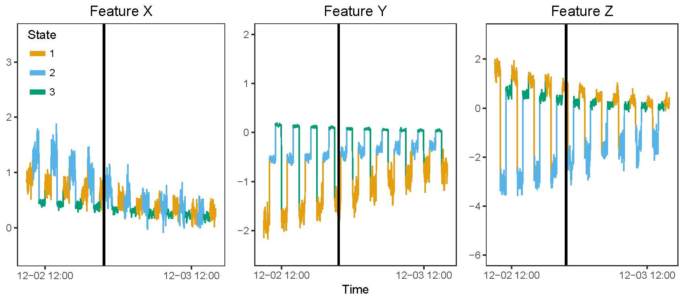
```

<!--
## Fault 1A
Add 2 to all features in all states.
```{r, fig.align = 'center', out.width='100%'}
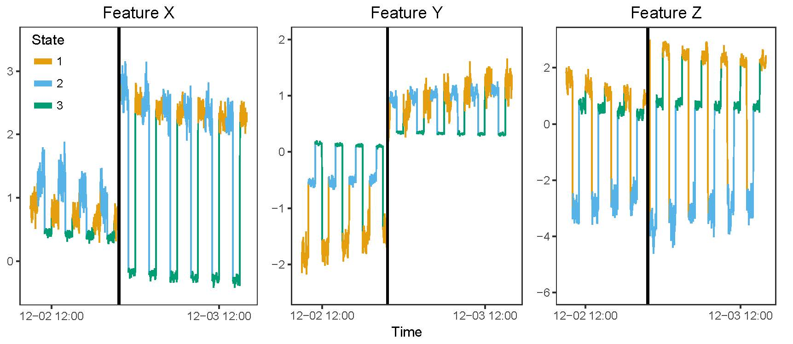
```
-->

## Fault 1B
Add 2 in all states to feature $X$ only. This shift in feature $X$ will infect features $Y$ and $Z$ through $\textbf{P}_2\boldsymbol\Lambda_2$ and $\textbf{P}_3\boldsymbol\Lambda_3$. 
```{r, fig.align = 'center', out.width='100%'}
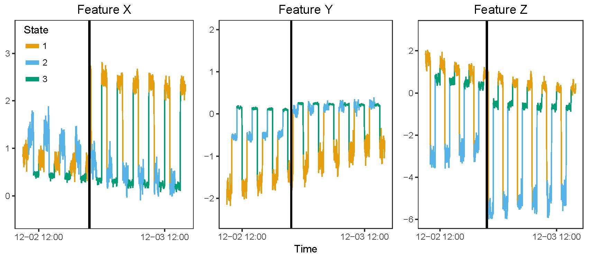
```

<!--
## Fault 1C
Add 0.5 to features $X$ and $Z$ only in state $\mathcal{S}_3$. This fault is induced after state projections.
```{r, fig.align = 'center', out.width='100%'}
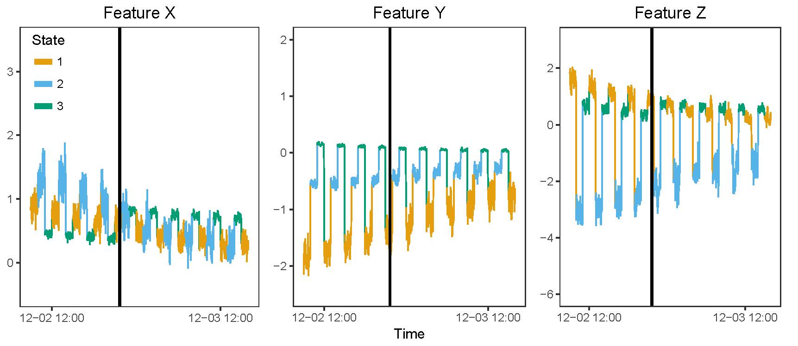
```
-->

<!--
## Drift Faults Defined

- __Fault 2A__: $\textbf{X}^*(t_s) = \textbf{X}(t_s) + (s - 8500)\times 10^{-3}$, $s > 8500.$ This fault simulates a positive drift across all the process monitoring features. This drift is added *before* state projections.

- __Fault 2B__: $y^*(t_s) = y(t_s) + (s - 8500)\times 10^{-3}$ and $z^*(t_s) = z(t_s) + (s - 8500)\times 10^{-3}$, for $s > 8500.$ This fault simulates a positive drift in two of the process monitoring features. This drift is added *before* state projections.

- __Fault 2C__: $y^*(t_s) = y(t_s) - 1.5 \times \frac{s - 8500}{10080 - 8500}$, for $s > 8500.$ This fault simulates a negative drift in one of the process monitoring features in $\mathcal{S}_2$ only. This drift is added *after* state projections.
-->

<!--
## Fault 2A
Drift all features in all states by a maximum $+1.58$.
```{r, fig.align = 'center', out.width='100%'}
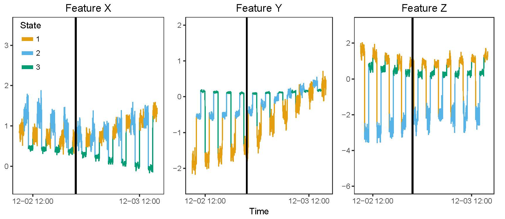
```
-->

<!--
## Fault 2B
Drift features $Y$ and $Z$ in all states by a maximum $+1.58$. This drift in features $Y$ and $Z$ will infect feature $X$ through $\textbf{P}_2\boldsymbol\Lambda_2$ and $\textbf{P}_3\boldsymbol\Lambda_3$. 
```{r, fig.align = 'center', out.width='100%'}
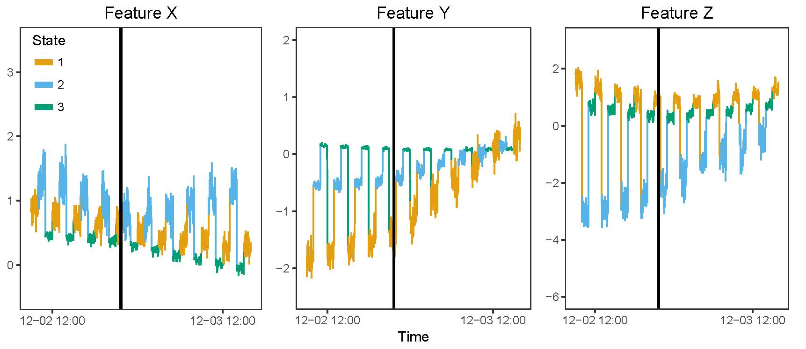
```
-->

## Fault 2C
Drift feature $Y$ by a maximum $-1.5$ only in state $\mathcal{S}_2$. This fault is induced after state projections.
```{r, fig.align = 'center', out.width='100%'}
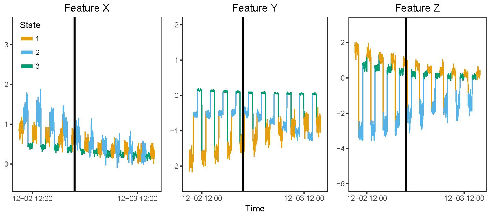
```

<!--
## Latent and Error Faults Defined
- __Fault 3A__: $\textbf{X}^*(t_s) = \textbf{X}(t_s^*)$, where $t_s^* = \left[\frac{\delta(s - 8500)}{\omega - 8500} + 1\right]t_s$. For $s > 8500,$ this fault will amplify the underlying latent effect for all features. The maximum latent drift of this fault will be $\delta + 1$. For the single-state simlation, $\delta + 1 = 3$; for the multi-state simulation, $\delta + 1 = 6$. This mutation is added *before* state projections.

- __Fault 3B__: $z^*(t_s) = z(t_s^*)$, where $t_s^* = \ln|t_s|$, $s \ge 8500.$ This fault will dampen the underlying latent effect for $x_3$ if $t_s > 1$ and amplify this effect if $t_s < 1$. This mutation is added *before* state projections.

- __Fault 3C__: $y^*(t_s) = y(t_s) + 2 * \textbf{e}_2(s) - 0.25$, for $s > 8500.$ This fault simulates an error increase and negative shift, but only applied to one process monitoring feature in $\mathcal{S}_2$. This mutation is added *after* state projections.
-->

## Fault 3A
Drift the latent variable $t$ by a maximum of $+6$ for all features in all states. 
```{r, fig.align = 'center', out.width='100%'}
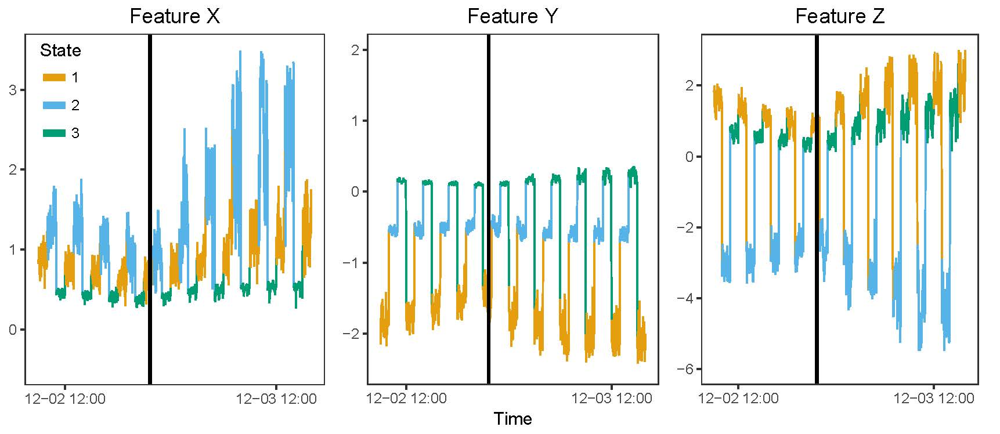
```

<!--
## Fault 3B
Mutate $t$ by $\log t$ in all states for feature $Z$ only. This mutation through feature $Z$ will infect features $X$ and $Y$ through $\textbf{P}_2\boldsymbol\Lambda_2$ and $\textbf{P}_3\boldsymbol\Lambda_3$. 
```{r, fig.align = 'center', out.width='100%'}
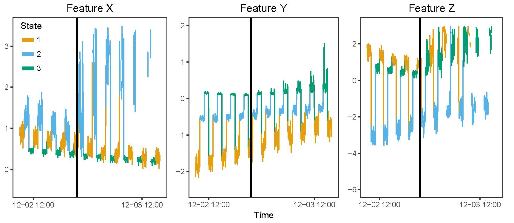
```
-->

<!--
## Fault 3C
Double and shift by $-0.25$ the machine-error vector on feature $Y$ in state $\mathcal{S}_2$ only. This fault is induced after state projections.
```{r, fig.align = 'center', out.width='100%'}
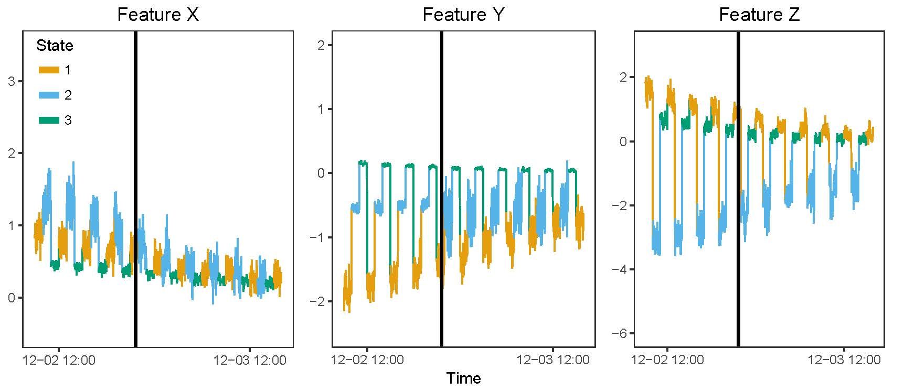
```
-->


# Simulation Study Results

<!--
## Simulation Results
We present an example of parsing the following tables:

- Consider the $T^2$ monitoring statistic on multi-state process data after projections with the AD-PCA projection matrix.
- This statistic has an expected ~18 false alarms per day.
- Now consider this statistic's monitoring behavior for Fault 1C.
- This statistic detects a fault in 96.5% of the 1000 simulation replicates.
- When the $T^2$ statistic detected a fault, it did so after 122 minutes, on average.
- When the $T^2$ statistic detected a fault, it did so within 490 minutes in 95% of cases.
- The cell is not shaded green, so this statistic had less than median detection probability. The median detection probability was 100%.
-->

<!--
## False Alarm Rates
```{r, fig.align = 'center', out.width='100%'}
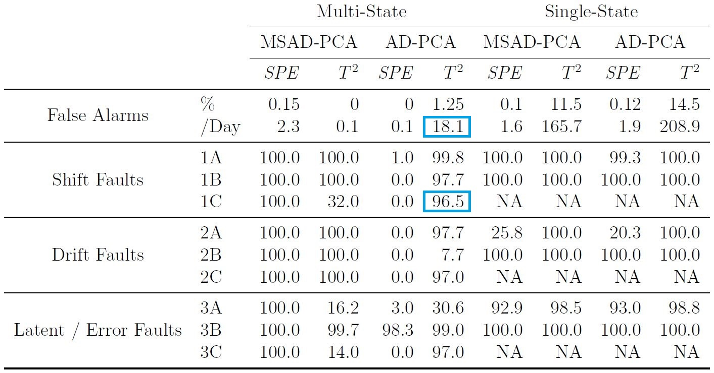
```
-->

## False Alarm Rates
```{r, fig.align = 'center', out.width='90%'}
knitr::include_graphics("false_alarms2.jpg")
```


<!--

## False Alarm Rates kable
```{r, results='asis'}
library(readxl)
false_alarms <- read_excel("~/GitHub/QPRC_Presentation/false_alarms.xlsx", 
    col_names = FALSE)
library(knitr)
library(kableExtra)
false_alarms2 <- false_alarms[-(1:3),]
false_alarms2[2, 3] <- 2.3; false_alarms2[2, 6] <- 18.1
false_alarms2[,1] <- c("False Alarms", "",
                       "", "Shift Faults", "",
                       "", "Drift Faults", "",
                       "", "Latent/Error Faults", "")
kable(false_alarms2, "html",
      col.names = c("", "", "SPE", "T2", "SPE", "T2", "SPE", "T2", "SPE", "T2")) %>%
  kable_styling(bootstrap_options = "striped")
```
 | |**Multi-State**| | | |**Single-State**| | | 
:-----:|:-----:|:-----:|:-----:|:-----:|:-----:|:-----:|:-----:|:-----:|:-----:
 | |MSAD SPE|MSAD T^2|AD SPE|AD T^2|MSAD SPE|MSAD T^2|AD SPE|AD T^2
False Alarms|%|0.15|0|0|1.25|0.1|11.5|0.12|14.5
 |Per Day|2.3|0.1|0.1|18.1|1.6|165.7|1.9|208.9
Shift Faults|1A|100.0|100.0|1.0|99.8|100.0|100.0|99.3|100.0
 |1B|100.0|100.0|0.0|97.7|100.0|100.0|100.0|100.0
 |1C|100.0|32.0|0.0|96.5|NA|NA|NA|NA
Drift Faults|2A|100.0|100.0|0.0|97.7|25.8|100.0|20.3|100.0
 |2B|100.0|100.0|0.0|7.7|100.0|100.0|100.0|100.0
 |2C|100.0|100.0|0.0|97.0|NA|NA|NA|NA
Latent or Error Faults|3A|100.0|16.2|3.0|30.6|92.9|98.5|93.0|98.8
 |3B|100.0|99.7|98.3|99.0|100.0|100.0|100.0|100.0
 |3C|100.0|14.0|0.0|97.0|NA|NA|NA|NA
-->

<!--
## Detection Times
```{r, fig.align = 'center', out.width='100%'}
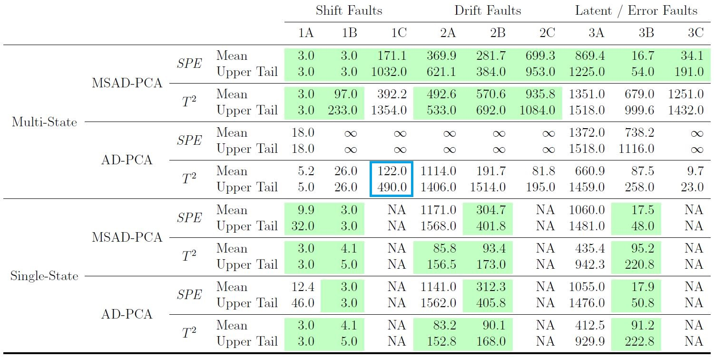
```
-->

## Detection Times
```{r, fig.align = 'center', out.width='90%'}
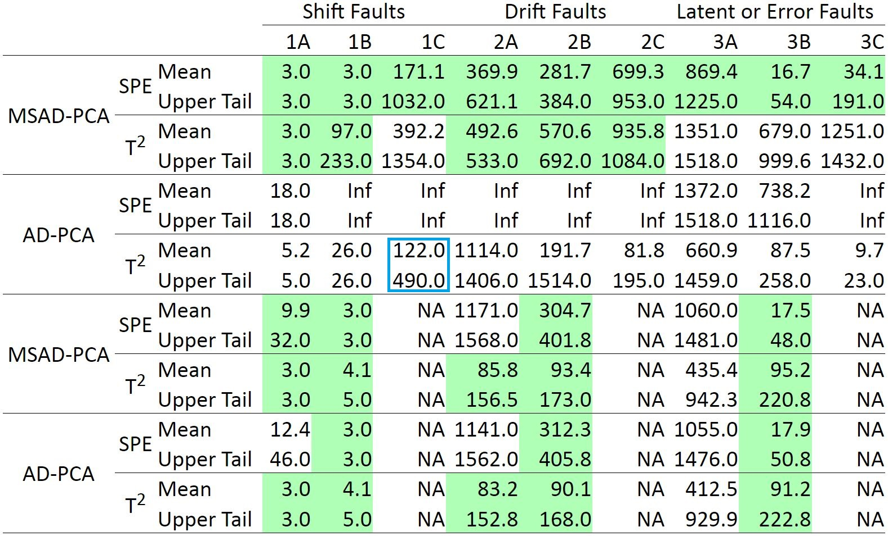
```

## Comparison
Under the Multi-State model:

- The AD-PCA *SPE* monitoring statistic is not sensitive enough to detect faults reliably.
- The AD-PCA $T^2$ monitoring statistic detects faults reliably, but has far too many false alarms.
- The MSAD-PCA *SPE* monitoring statistic offers an excellent combination of sensitivity and high detection probability.
- The MSAD-PCA $T^2$ monitoring statistic offers an excellent combination of specificity and high detection probability.

Under the Single-State model, the pairs of AD-PCA and MSAD-PCA process monitoring statistics perform similarly, so we do not expect significant loss of power when using the MSAD-PCA procedure to detect faults.


# Case Study Results

## False Alarm Rates
We increased the flags to trigger an alarm from 3 to 5 for the real case due to strong serial autocorrelation. Note that these false alarm rates are all greater than or equal to the set threshold level of $\alpha = 0.1\%$.

                   MSAD $T^2$   MSAD *SPE*   AD $T^2$   AD *SPE*
----------------   ----------   ----------   --------   --------
False Alarm Rate         0.1%         0.3%       0.3%       0.3%


## Fault Detection Times
```{r, fig.align = 'center', out.width='100%'}
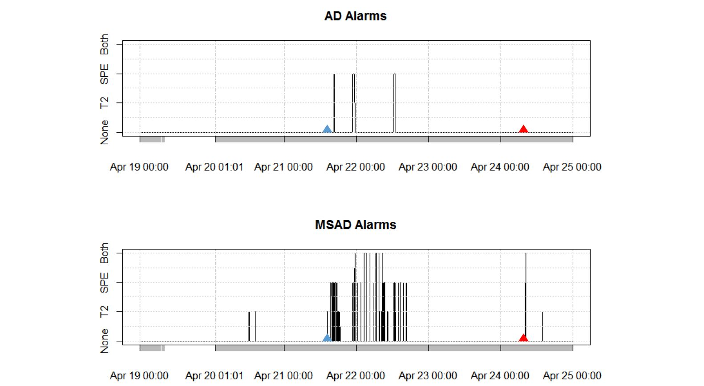
```


# Software Package for `R`

## Package `mvMonitoring`
- No website: our package is currently in private beta-testing at the facility. 
- `mspProcessData()` generates random draws from a serially autocorrelated and nonstationary multi-state (or single-state) multivariate process.
- `mspTrain()` trains the projection matrix and non-parametric fault detection thresholds.
- `mspMonitor()` assesses incoming process observations and classifies them as normal or abnormal.
- `mspWarning()` keeps a running tally of abnormal observations and raises an alarm if necessary.
- Alarms can be sent via email or SMS from the remote facility to the operators.


# Summary and References

## Summary
### Overview
- Explained the motivation for a multi-state modification to PCA.
- Presented the MSAD-PCA dimension reduction procedure.
- Described the simulation study used to validate the effectiveness of MSAD-PCA.
- Discussed the simulation study and real data results.

### MSAD-PCA Findings
- Helps detect faults faster and more consistently in multi-state processes
- Doesn't suffer loss of power when applied to single-state processes
- Moves another step toward fault attribution


## Future Work


<style>
  slides > slide { overflow: scroll; }
slides > slide:not(.nobackground):after {
  content: '';
}
</style>
  
## References {.smaller}
  
  
<!--
# Multi-State Multivariate Process Monitoring

## The Problem Defined

- We compute the Squared Prediction Error (SPE) and Hotelling's $T^2$ statistics regularly to check divergence from Normal Operating Conditions (NOC).

## Example Process Graphs: NOC vs. Fault
```{r, fig.align = 'center'}
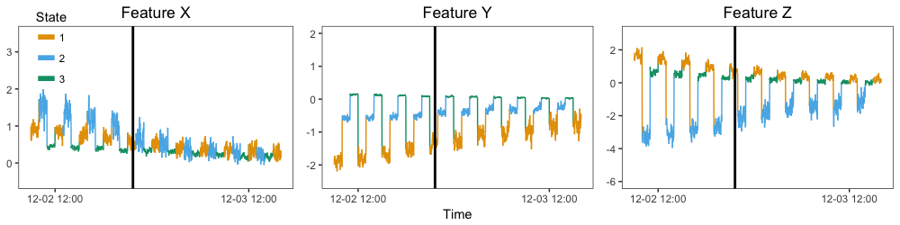
```
```{r, fig.align = 'center'}
knitr::include_graphics("Fault2A_20170317.png")
```

## Current Approaches


## MSAD-PCA: Our Contribution
We choose to work with AD-PCA because it is simple in idea and computation and has non-inferior to superior results to more complicated methods.

- As the process-dimension increases, computation of process statistics increase cubically unde PCA. We must reduce the data dimension.
- Feature distributions change over time and are serially correlated (Adaptive-Dynamic PCA).
- Some processes have multiple states: samples include brain waves during different parts of the sleep cycle or chemical concentrations in a tank during different cleaning steps.
- These states are highly discrete and can cause data matrix instability (near-0 variance).
- Feature distributions change with different known process states, so we block on them. This is Multi-State ADPCA (MSAD-PCA).

## Synthetic Data Fault Detection Time
We present the distribution of time in minutes after synthetic fault induction until the first alarm by each linear projection method. We also record the censoring percentatge for each method (OOB%), which states what percentage of the time the specified method failed to detect a fault within 24 hours. Finally, we also include the expected number of false alarms per day by method.

0.05      Mean      0.95      OOB%   False Alarm %   False Alarms / Day
--------   --------   -------   -------   -------   -------         -------
MSAD SPE        264       370       621        0%   0.2%            2.88
MSAD T2         364       493       533        0%   0.0%            0
AD SPE          Inf       Inf       Inf      100%   0.0%            0
AD T2            35      1114      1406      2.3%   1.5%            21.6


## Real Data

- We have choices for the blocking variables:

+ Blower operation: controls aeration of the mixture.
+ Sequencing Batch Bioreactor Phase: fill, mix, steep, or release.
+ Membrane Bioreactor Mode: mixing, cleaning, etc.
--->