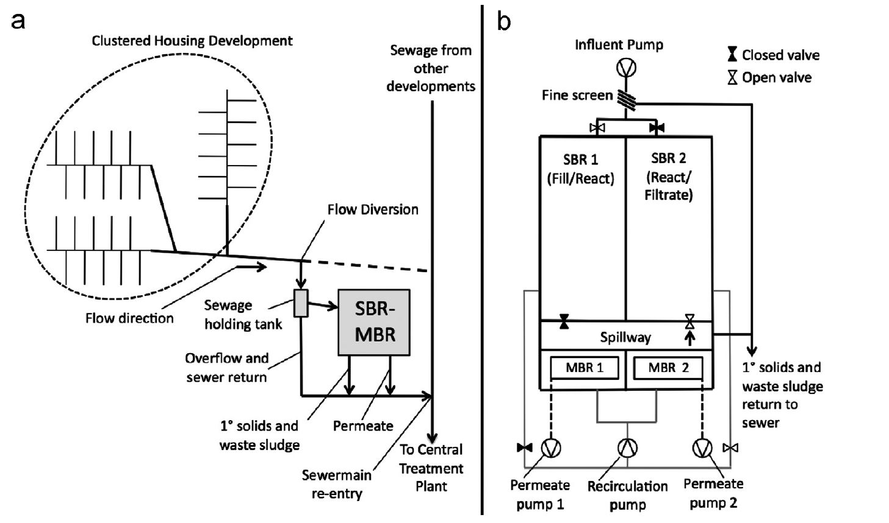

  ```{r setup, include=FALSE}
knitr::opts_chunk$set(echo = FALSE)
```

## Overview of Topics

- Introduction
- Modifying Principal Component Analysis
- Simulation Design
- Simulation Results
- Case Study
- Conclusion and Future work
- References


<div class="notes">
  Smile! :) You got this!
  </div>
  
# Introduction
  
## Introduction
- Many factories or other closed production systems use real-time online process monitoring.
- We aim to detect potential problems within the system before they cause damage or cause the process to shut down.
- The process has many sensors, with a time series for each.
- These sensor readings are not independent across time, and their values may have daily trends / perturbations (autocorrelated and non-stationary).
- The sensors themselves are not independent (cross-correlation of the multiple time series).
- Distributions of process variables can change dramatically with operator input.

## Process Dimensionality
- In multivariate contexts, the number of parameters to estimate increases quadratically with dimension.
- That is, we must estimate $p + \frac{p}{2}(p + 1) \in \mathbb{O}(p^2)$ first- and second-moment parameters if we have $p$ features.
- Linear dimension reduction (LDR) allows us to simplify complex data structures to more simple data structures via linear combinations of features.
- LDR is built around eigen-decomposition / principal component analysis (PCA) or the singular value decomposition (SVD).


## Motivating Example
- This work is motivated by our partnership with the Colorado School of Mines on the ReNUWit water preservation grant.
- Our team manages a decentralised wastewater treatment (WWT) plant in Golden, CO.
- We measure 40 features and their lagged values (80 total features).
- The continuous features are aggregated to the minute-level.
- We aim to develop a monitoring process capable of quickly and accurately detecting when a part of the cleaning process malfunctions before human operators.
- Earlier work applying PCA to WWT was completed by @wise_principal_1988 and @kresta_multivariate_1991
- More recent work applying PCA was by @baggiani_real-time_2009, @sanchez-fernandez_fault_2015, and @kazor_comparison_2016

## The Bioreactor System
```{r, fig.align = 'center', out.width='90%'}

```

## Multi-State Process
```{r, fig.align = 'center', out.width='85%', out.height='50%'}
knitr::include_graphics("RAS_DOxBlow_20170529.png")
```

## Competing Methods
PCA fails because of the autocorrelated and non-linearity / non-stationarity of the data. These are a few of the methods currently employed:

- Adaptive-Dynamic PCA (AD-PCA) of @kazor_comparison_2016
- Kernel PCA (kPCA) of @ge_improved_2009
- Adaptive kPCA (AkPCA) of @chouaib_adaptive_2013
- Local Linear Embedding (LLE) @miao_nonlinear_2013
- Multi-dimensional scaling and isometric mapping (IsoMap) of @tenenbaum_global_2000
- Semidefinite Embedding (SDE) / Maximimum Variance Unfolding (MVU) of @weinberger_unsupervised_2006


# Modifying PCA

## Process Notation
- $\mathcal{P}$ is a real non-linear, autocorrelated, non-stationary, state-switching, $p$-dimensional multivariate process.
- $s = 1, \ldots, n$ is the observation index of $\mathcal{P}$.
- $\textbf{X}_s := \left(X_1(s), X_2(s), \ldots, X_p(s)\right) \in\mathbb{R}_{1 \times p}$ is a whitened realization from $\mathcal{P}$.
- $\textbf{X} := [\textbf{X}_1\ \vdots\ \textbf{X}_2\ \vdots\ \cdots\ \vdots\ \textbf{X}_n]^T \in \mathbb{R}_{n\times p}$ is the data matrix.
- $\textbf{X}^T\textbf{X}\in\mathbb{R}_{p \times p}^{\ge}$ is the scatter matrix of $\textbf{X}$.
- $\mathbb{R}_{p \times p}^{\ge}$ is $p$-dimensional the cone of real, non-negative definite matrices.

## PCA Basics
- $\textbf{X}^T\textbf{X} := \underset{p \times p}{\textbf{P}} \times \underset{p \times p}{\boldsymbol\Lambda} \times \underset{p \times p}{\textbf{P}}^T$ is the eigendecomposition of the scatter matrix.
- $\textbf{P}^T$ is the $p \times p$ orthogonal matrix of eigenvectors.
- $\boldsymbol\Lambda$ is the diagonal matrix of the $p$ eigenvalues.
- $\textbf{P}_d$ is the $p\times d$ projection matrix preserving the total data variation corresponding to 
\[
\left[\sum\limits_{i = 1}^d \lambda_i\right] / \text{tr}\left(\boldsymbol\Lambda\right).
\]
- $\textbf{Y}_s := \textbf{X}_s\textbf{P}_d \in\mathbb{R}_{1\times d}$ is the reduced-dimension representation of observation $\textbf{X}_s$.

## Adaptive PCA
For an excellent summary of Adaptive and Dynamic PCA, see @ge_multivariate_2012.

- Assume $\mathcal{P}$ is locally linear within a window $w$.
- Create a $w$-width rolling training window preceding index $s$ by defining
\[
\textbf{X}_{w} := [\textbf{X}_{s - w + 1}\ \vdots\ \textbf{X}_{s - w + 2}\ \vdots\ \cdots\ \vdots\ \textbf{X}_{s - 1}\ \vdots\ \textbf{X}_s]^T.
\]
- Calculate the scatter matrix with $\textbf{X}_{w}$ instead of the full data matrix $\textbf{X}$.
- Estimate $\textbf{P}_d$.
- After performing necessary monitoring statistics on the new observations, ''learn'' the newest $n_u$ observations, ''forget'' the oldest $n_u$ observations, and estimate the new scatter matrix.

## Dynamic PCA
- Because the features are correlated over time, we include up to $\ell$ lags per feature.
- The observation at index $s$ is now
$$
\begin{align}
\text{L}(\textbf{X}_s) := &[X_1(s), X_1\left( s - 1 \right), \ldots, X_1\left( s - \ell \right),\ X_2(s), X_2\left( s - 1 \right), \ldots, X_2\left( s - \ell \right), \\
&\qquad \cdots,\ X_p(s),  X_p\left( s - 1 \right), \ldots, X_p\left( s - \ell \right)].
\end{align}
$$
- These $n - \ell$ rows form the lagged data matrix
\[
\text{L}(\textbf{X}) := [\text{L}(\textbf{X}_{\ell})\ \vdots\ \text{L}(\textbf{X}_{\ell + 1})\ \vdots\ \cdots\ \vdots\ \text{L}(\textbf{X}_n)]^T \in\mathbb{R}_{(n - \ell) \times p(\ell + 1)}.
\]
- Calculate the scatter matrix with $\text{L}(\textbf{X})$ instead of the data matrix $\textbf{X}$.
- Estimate the $p(\ell + 1) \times d$ projection matrix $\textbf{P}_d$.

## Multi-State AD-PCA

## Monitoring Statistics

### Hotelling's $T^2$

### Squared Prediction Error

### Threshold Estimation


# Simulation Design

## Notation

## Details of Data Generation
- We follow @kazor_comparison_2016 and continue updating the original design of @dong_batch_1996

### Errors and Latent Feature Construction

### Feature and State Definitions

## Faults

### Shift Faults

#### Faults Defined

#### Faults Visualized

### Drift Faults

#### Faults Defined

#### Faults Visualized

### Latent and Error Faults

#### Faults Defined

#### Faults Visualized

## Monte Carlo Replication


# Simulation Study Results

## Simulation Results

## False Alarm Rates

## Detection Times


# Case Study

## Motivation

## Facility and Process Details

## Data Cleaning

## Method Results

### False Alarm Rates

### Fault Detection Times


# Conclusion

## Conclusion


# Multi-State Multivariate Process Monitoring

## The Problem Defined

- We compute the Squared Prediction Error (SPE) and Hotelling's $T^2$ statistics regularly to check divergence from Normal Operating Conditions (NOC).

## Example Process Graphs: NOC vs. Fault
```{r, fig.align = 'center'}
knitr::include_graphics("NOC_20170317.png")
```
```{r, fig.align = 'center'}
knitr::include_graphics("Fault2A_20170317.png")
```

## Current Approaches


## MSAD-PCA: Our Contribution
We choose to work with AD-PCA because it is simple in idea and computation and has non-inferior to superior results to more complicated methods.

- As the process-dimension increases, computation of process statistics increase cubically unde PCA. We must reduce the data dimension.
- Feature distributions change over time and are serially correlated (Adaptive-Dynamic PCA).
- Some processes have multiple states: samples include brain waves during different parts of the sleep cycle or chemical concentrations in a tank during different cleaning steps.
- These states are highly discrete and can cause data matrix instability (near-0 variance).
- Feature distributions change with different known process states, so we block on them. This is Multi-State ADPCA (MSAD-PCA).

## Synthetic Data Fault Detection Time
We present the distribution of time in minutes after synthetic fault induction until the first alarm by each linear projection method. We also record the censoring percentatge for each method (OOB%), which states what percentage of the time the specified method failed to detect a fault within 24 hours. Finally, we also include the expected number of false alarms per day by method.

0.05      Mean      0.95      OOB%   False Alarm %   False Alarms / Day
--------   --------   -------   -------   -------   -------         -------
MSAD SPE        264       370       621        0%   0.2%            2.88
MSAD T2         364       493       533        0%   0.0%            0
AD SPE          Inf       Inf       Inf      100%   0.0%            0
AD T2            35      1114      1406      2.3%   1.5%            21.6


## Real Data

- We have choices for the blocking variables:

+ Blower operation: controls aeration of the mixture.
+ Sequencing Batch Bioreactor Phase: fill, mix, steep, or release.
+ Membrane Bioreactor Mode: mixing, cleaning, etc.

## Package `mvMonitoring`
- No website: our package is currently in private beta-testing at the facility.    
- So far, engineers have been pleased with what we've developed so far, and they are working with us closely to polish the package. 
- `mspProcessData()` generates random draws from a serially autocorrelated and nonstationary multi-state (or single-state) multivariate process.
- `mspTrain()` trains the projection matrix and fault detection components.
- `mspMonitor()` assesses incoming process observations and classifies them as normal or abnormal.
- `mspWarning()` keeps a running tally of abnormal observations and raises an alarm if necessary.
- Alarms can be sent via email or SMS from the remote facility to the operators or to the central facility.


# Summary and References

## Summary

- We have described three applications of linear dimension reduction.
- We have presented three accompanying real data sets and discussed their details.
- We have discussed three code packages.

## Future Work
- Savvy Feature Filtering: use the SVD "backwards" to select features which have strong influence on a classifier.
- Optimal Principal Component Selection: rather than choosing features by the largest eigenvalues, choose features by their contribution to between-class variance.

<style>
  slides > slide { overflow: scroll; }
slides > slide:not(.nobackground):after {
  content: '';
}
</style>
  
  ## References {.smaller}
  
  
  